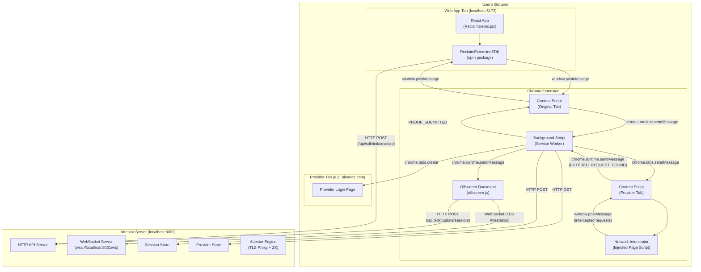
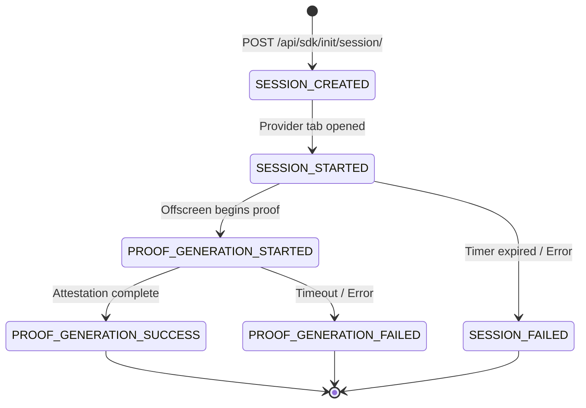
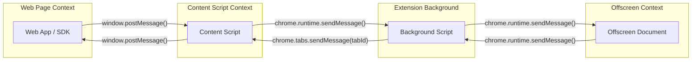

# Verify Button Data Flow — Complete Analysis

## Overview

This document traces the complete data flow when a user clicks the **"Verify"** button in the `reclaim-browser-extension-sdk/examples/web-app`. It covers every component involved, message passing patterns, HTTP/WebSocket API calls, and proof generation.

---

## Service Deployment Topology



---

## Detailed Step-by-Step Flowchart

```mermaid
sequenceDiagram
    participant User
    participant WebApp as Web App<br/>(ReclaimDemo.jsx)
    participant SDK as ReclaimExtensionSDK
    participant CS1 as Content Script<br/>(Original Tab)
    participant BG as Background Script
    participant Backend as Attestor Backend<br/>(localhost:8001)
    participant ProvTab as Provider Tab<br/>(e.g. Binance)
    participant CS2 as Content Script<br/>(Provider Tab)
    participant NI as Network Interceptor
    participant OFF as Offscreen Document

    Note over User,OFF: Phase 1: Initialization

    User->>WebApp: Click "Verify" button
    WebApp->>SDK: reclaimExtensionSDK.init(APP_ID, APP_SECRET, providerId, {extensionID})
    SDK->>SDK: Generate signature = sign(providerId + "\n" + timestamp)
    SDK->>Backend: POST /api/sdk/init/session/<br/>{appId, providerId, timestamp, signature}
    Backend->>Backend: createSession() → store in memory
    Backend-->>SDK: {sessionId, resolvedProviderVersion}
    SDK-->>WebApp: ReclaimExtensionProofRequest instance

    Note over User,OFF: Phase 2: Start Verification

    WebApp->>SDK: request.startVerification()
    SDK->>CS1: window.postMessage({action: "START_VERIFICATION", templateData})
    CS1->>BG: chrome.runtime.sendMessage({action: "START_VERIFICATION"})

    Note over User,OFF: Phase 3: Provider Navigation

    BG->>Backend: GET /api/providers/{providerId}
    Backend-->>BG: Provider config (loginUrl, responseSelections, etc.)
    BG->>BG: Store providerData, set activeTabId, start session timer
    BG->>Backend: POST /api/sdk/update/session/<br/>{sessionId, status: "SESSION_STARTED"}
    BG->>ProvTab: chrome.tabs.create({url: providerData.loginUrl})
    BG->>CS2: SHOW_PROVIDER_VERIFICATION_POPUP
    BG->>CS2: PROVIDER_DATA_READY (providerData, parameters)

    Note over User,OFF: Phase 4: Network Interception

    CS2->>CS2: Inject network interceptor & injection scripts
    CS2->>CS2: startNetworkFiltering() — poll every 2s
    User->>ProvTab: Login / Navigate on provider site
    NI->>NI: Intercept fetch/XHR matching provider URL patterns
    NI->>CS2: window.postMessage({type: "INTERCEPTED_REQUEST"})
    CS2->>CS2: filterRequest() — match URL against responseSelections
    CS2->>BG: chrome.runtime.sendMessage({action: "FILTERED_REQUEST_FOUND"})

    Note over User,OFF: Phase 5: Claim Creation

    BG->>BG: processFilteredRequest()
    BG->>BG: Retrieve cookies via chrome.cookies.getAll()
    BG->>OFF: GET_PRIVATE_KEY
    OFF->>OFF: crypto.getRandomValues(32 bytes)
    OFF-->>BG: privateKey (0x...)
    BG->>BG: createClaimObject()<br/>Extract params from URL/body/response<br/>Separate public vs secret parameters
    BG->>BG: proofQueue.addToProofGenerationQueue(claimData)

    Note over User,OFF: Phase 6: Proof Generation (ZK-TLS)

    BG->>OFF: GENERATE_PROOF {claimData}
    OFF->>Backend: POST /api/sdk/update/session/<br/>{status: "PROOF_GENERATION_STARTED"}
    OFF->>Backend: WebSocket connect to wss://localhost:8001/ws
    OFF->>OFF: createClaimOnAttestor(claimData)<br/>→ TLS handshake via attestor proxy<br/>→ Replay HTTP request through TLS tunnel<br/>→ Generate ZK proof of response content
    Backend->>Backend: AttestorServerSocket handles RPC:<br/>- Create TLS tunnel<br/>- Proxy TLS traffic<br/>- Verify & sign attestation
    Backend-->>OFF: Signed attestation / proof result
    OFF->>Backend: POST /api/sdk/update/session/<br/>{status: "PROOF_GENERATION_SUCCESS"}
    OFF->>BG: GENERATE_PROOF_RESPONSE {success: true, proof}

    Note over User,OFF: Phase 7: Proof Submission

    BG->>BG: processNextQueueItem() → all proofs done
    BG->>BG: submitProofs() — format proofs
    alt Has callbackUrl
        BG->>Backend: POST {callbackUrl} with proofs
    else No callbackUrl
        BG->>Backend: POST /api/sdk/update/session/<br/>{status: "PROOF_GENERATION_SUCCESS", proofs}
    end
    BG->>CS2: PROOF_SUBMITTED {formattedProofs}
    BG->>CS1: PROOF_SUBMITTED {formattedProofs}
    CS1->>SDK: window.postMessage({action: "VERIFICATION_COMPLETED", proofs})
    SDK->>WebApp: "completed" event with proof data
    BG->>BG: Close provider tab, restore original tab
```

---

## API Endpoints Summary

| Endpoint                              | Method    | Purpose                                | Caller → Server                 |
| ------------------------------------- | --------- | -------------------------------------- | ------------------------------- |
| `/api/sdk/init/session/`              | POST      | Create new verification session        | SDK → Attestor                  |
| `/api/sdk/update/session/`            | POST      | Update session status                  | Background/Offscreen → Attestor |
| `/api/sdk/session/:id`                | GET       | Get session data                       | SDK → Attestor                  |
| `/api/providers/:id`                  | GET       | Fetch provider configuration           | Background → Attestor           |
| `/api/providers/:id/custom-injection` | GET       | Get provider's custom injection script | Background → Attestor           |
| `/session/:id/proof`                  | POST      | Submit generated proof                 | Background → Attestor           |
| `/api/logs`                           | POST      | SDK log dump endpoint                  | SDK → Attestor                  |
| `wss://.../ws`                        | WebSocket | TLS proxy attestation tunnel           | Offscreen → Attestor            |

---

## Session Status Lifecycle



---

## Key Component Responsibilities

| Component                  | Location                           | Role                                                             |
| -------------------------- | ---------------------------------- | ---------------------------------------------------------------- |
| **ReclaimDemo.jsx**        | `examples/web-app/src/`            | UI entry point, calls SDK                                        |
| **ReclaimExtensionSDK.js** | `src/`                             | SDK library: init session, manage events                         |
| **Content Script**         | `src/content/content.js`           | Bridge between web page ↔ extension; intercepts network traffic |
| **Network Interceptor**    | `src/interceptor/`                 | Injected into provider page to capture fetch/XHR                 |
| **Background Script**      | `src/background/background.js`     | Central orchestrator: routes messages, manages state             |
| **Session Manager**        | `src/background/sessionManager.js` | Handles session lifecycle, proof submission                      |
| **Message Router**         | `src/background/messageRouter.js`  | Dispatches messages to handlers                                  |
| **Claim Creator**          | `src/utils/claim-creator/`         | Builds claim object from intercepted data                        |
| **Proof Queue**            | `src/background/proofQueue.js`     | Sequential proof generation queue                                |
| **Proof Generator**        | `src/utils/proof-generator/`       | Manages offscreen document for proof gen                         |
| **Offscreen Document**     | `src/offscreen/offscreen.js`       | Runs `createClaimOnAttestor()`, private key gen                  |
| **create-server.ts**       | `attestor-core/src/server/`        | HTTP + WebSocket server setup                                    |
| **session-api.ts**         | `attestor-core/src/server/`        | Session CRUD endpoints                                           |
| **provider-api.ts**        | `attestor-core/src/server/`        | Provider config endpoints                                        |
| **socket.ts**              | `attestor-core/src/server/`        | WebSocket RPC handler for TLS attestation                        |

---

## Message Passing Architecture



> [!IMPORTANT]
> The extension uses **three isolated JavaScript contexts** that cannot directly share memory. All communication uses message passing (window.postMessage for page ↔ content script, chrome.runtime.sendMessage for extension-internal).

---

## Data Structures

### Claim Object (created by `createClaimObject()`)

```json
{
  "infoHash": "<keccak256 hash>",
  "owner": "<ethereum address>",
  "provider": "<providerId>",
  "timestampS": 1706000000,
  "context": "{\"contextAddress\":\"0x0\",\"contextMessage\":\"\"}",
  "parameters": { "paramName": "value" },
  "secretParams": { "cookieName": "cookieValue", "authToken": "..." },
  "ownerPrivateKey": "0x...",
  "sessionId": "session-uuid",
  "publicData": "{\"extractedParam\":\"value\"}"
}
```

### Proof Result (returned from attestor)

```json
{
  "identifier": "<claim hash>",
  "claimData": { "provider": "...", "parameters": "...", "owner": "..." },
  "signatures": ["<attestor signature>"],
  "witnesses": [{ "id": "...", "url": "wss://..." }],
  "publicData": "..."
}
```
